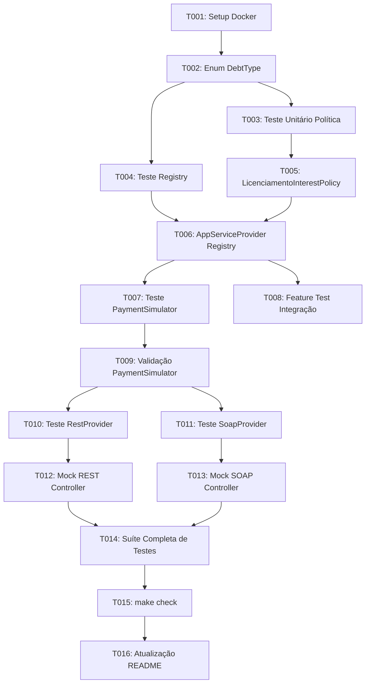

# Tasks: Adição do Débito de Licenciamento

**Input**: Design documents from `/specs/006-add-licenciamento-debt/` (`spec.md`, `plan.md`, `research.md`, `data-model.md`, `contracts/`, `quickstart.md`)  
**Prerequisites**: plan.md, spec.md, research.md, data-model.md, contracts/  
**Organization**: Tasks are grouped by user story to enable independent implementation and testing of each story.

## Format: `[ID] [P?] [Story] Description`

- **[P]**: Can run in parallel (different files, no dependencies)
- **[Story]**: Which user story this task belongs to (`[US1]`, `[US2]`, `[US3]`)
- Include exact file paths in descriptions

---

## Phase 1: Setup

**Purpose**: Verificação do ambiente de execução e estado inicial do repositório

- [x] T001 Verificar a prontidão e saúde dos contêineres Docker via `Makefile` em `docker-compose.yml`

---

## Phase 2: Foundational (Blocking Prerequisites)

**Purpose**: Definição canônica fundamental do tipo de débito necessária para todas as histórias de usuário

**⚠️ CRITICAL**: Nenhuma história de usuário pode ser finalizada sem a adição do tipo canônico no enum de domínio.

- [x] T002 Adicionar o caso canônico `LICENCIAMENTO = 'LICENCIAMENTO'` no enum `App\Domain\Debt\DebtType` em `monolith/app/Domain/Debt/DebtType.php`

**Checkpoint**: Enum canônico preparado — implementação das histórias de usuário desbloqueada.

---

## Phase 3: User Story 1 - Consulta e Cálculo de Juros do Licenciamento em Atraso (Priority: P1) 🎯 MVP

**Goal**: Permitir o cálculo exato de encargos por mora de Licenciamento com taxa de 0,33% ao dia e teto de 20% com base no vencimento.

**Independent Test**: Executar testes unitários comprovando cálculo com 0 dias de atraso, 10 dias de atraso e mais de 60 dias (respeitando o teto de 20%).

### Tests for User Story 1

- [x] T003 [P] [US1] Criar teste unitário da estratégia de cálculo em `monolith/tests/Unit/Domain/Debt/Policies/LicenciamentoInterestPolicyTest.php`
- [x] T004 [P] [US1] Atualizar testes do registro de políticas em `monolith/tests/Unit/Domain/Debt/Policies/DebtInterestPolicyRegistryTest.php` para validar o tipo `LICENCIAMENTO`

### Implementation for User Story 1

- [x] T005 [US1] Implementar a política de cálculo `LicenciamentoInterestPolicy` implementando `DebtInterestPolicyInterface` em `monolith/app/Domain/Debt/Policies/LicenciamentoInterestPolicy.php`
- [x] T006 [US1] Registrar `LicenciamentoInterestPolicy` no `DebtInterestPolicyRegistry` dentro do Service Provider em `monolith/app/Providers/AppServiceProvider.php`

**Checkpoint**: User Story 1 (MVP) concluída e testável de forma isolada no domínio.

---

## Phase 4: User Story 2 - Simulação de Pagamento com Opção Exclusiva de Licenciamento (Priority: P2)

**Goal**: Garantir que o valor atualizado do Licenciamento componha o totalizador `TOTAL` e gere a opção agrupada `SOMENTE_LICENCIAMENTO` com simulações de PIX e Cartão de Crédito.

**Independent Test**: Executar teste validando a presença e os cálculos da opção `SOMENTE_LICENCIAMENTO` com desconto de 5% no PIX e parcelamento na Tabela Price em 1x, 6x e 12x.

### Tests for User Story 2

- [x] T007 [P] [US2] Criar teste unitário em `monolith/tests/Unit/Domain/Payment/Services/PaymentSimulatorLicenciamentoTest.php` validando a geração da opção `SOMENTE_LICENCIAMENTO`
- [x] T008 [US2] Criar teste de integração da API em `monolith/tests/Feature/VehicleDebtLicenciamentoIntegrationTest.php` validando o payload completo com débitos de Licenciamento

### Implementation for User Story 2

- [x] T009 [US2] Validar e garantir a propagação correta de `SOMENTE_LICENCIAMENTO` no fluxo de agregação de pagamentos em `monolith/app/Domain/Payment/Services/PaymentSimulator.php`

**Checkpoint**: User Story 2 concluída — opções de pagamento operacionais com totalizadores e parcelamentos.

---

## Phase 5: User Story 3 - Recepção de Licenciamento de Múltiplos Fornecedores de Dados (Priority: P3)

**Goal**: Prover dados simulados de Licenciamento nos provedores externos REST e SOAP para testes ponta a ponta.

**Independent Test**: Realizar chamadas nos serviços `provider-rest` e `provider-soap` e verificar se débitos categorizados como `LICENCIAMENTO` são retornados e normalizados pelo monólito.

### Tests for User Story 3

- [x] T010 [P] [US3] Atualizar teste do adaptador REST em `monolith/tests/Unit/Infrastructure/Providers/RestVehicleDebtProviderTest.php` para validar ingestão de `LICENCIAMENTO`
- [x] T011 [P] [US3] Atualizar teste do adaptador SOAP em `monolith/tests/Unit/Infrastructure/Providers/SoapVehicleDebtProviderTest.php` para validar ingestão de `LICENCIAMENTO`

### Implementation for User Story 3

- [x] T012 [P] [US3] Adicionar débito simulado de Licenciamento no controller do mock REST em `provider-rest/app/Http/Controllers/VehicleDebtController.php`
- [x] T013 [P] [US3] Adicionar débito simulado de Licenciamento no controller do mock SOAP em `provider-soap/app/Http/Controllers/SoapVehicleDebtController.php`

**Checkpoint**: User Story 3 concluída — ecossistema multi-provider apto a fornecer débitos de Licenciamento em JSON e XML.

---

## Phase 6: Polish & Cross-Cutting Concerns

**Purpose**: Validação integrada, conformidade com a Constituição e integridade da suíte de testes

- [x] T014 Executar suíte completa de testes automatizados no monólito via `docker compose exec monolith php artisan test`
- [x] T015 Executar verificação geral de integridade e saúde do ecossistema via `make check`
- [x] T016 Atualizar a documentação arquitetural no `README.md` refletindo o suporte ao débito de Licenciamento

---

## Dependencies & Completion Order

---

## Parallel Execution Opportunities

- **Fase 3 (US1)**: `T003` e `T004` podem ser desenvolvidos em paralelo antes da implementação em `T005`.
- **Fase 4 (US2)**: `T007` e `T008` podem ser elaborados em paralelo.
- **Fase 5 (US3)**: `T010` e `T011` (testes de adaptadores), bem como `T012` e `T013` (mocks dos provedores REST e SOAP) são 100% independentes e paralelizáveis.

---

## Implementation Strategy

1. **MVP (Fase 1, 2 e 3)**: Entrega do suporte no Domínio e cálculo de juros diários com teto de 20% (garantindo validação unitária imediata).
2. **Incremento 2 (Fase 4)**: Agregação da opção `SOMENTE_LICENCIAMENTO` e simulação de parcelamentos no fluxo financeiro.
3. **Incremento 3 (Fase 5)**: Interoperabilidade ponta a ponta com os serviços externos REST e SOAP.
4. **Fechamento (Fase 6)**: Validação regressiva 100% verde e documentação.
